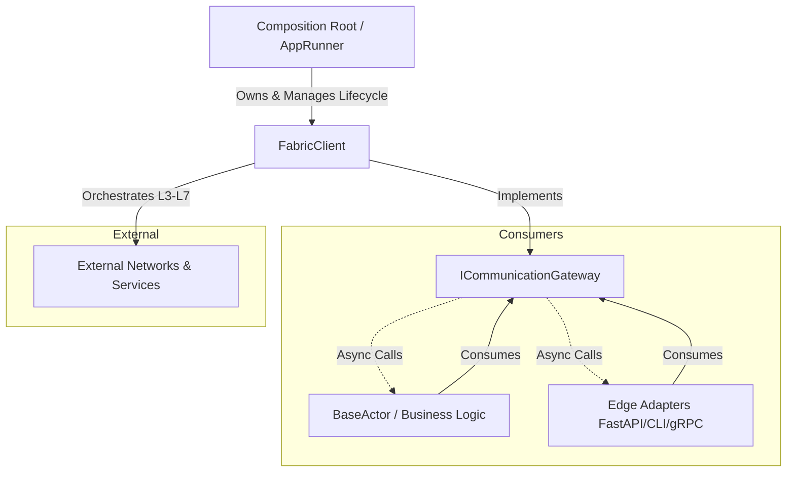
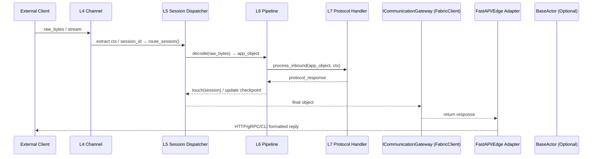

# 📐 ARCHITECTURE.md

# Layered Composable Multi-Protocol Communication Fabric
> **A contract-driven, adapter-based transport & session orchestration stack spanning OSI L3 → L7.**  
> Built for zero-downtime protocol switching, resilient session management, and clean separation between business logic and communication infrastructure.

---

## 🧭 Architecture Overview

The system is a **Layered Composable Multi-Protocol Communication Fabric**. It abstracts network complexity behind a single, unified entry point (`FabricClient`) while preserving strict layer boundaries, contract-based dependency inversion, and dynamic configurability.

| Dimension | Implementation |
|-----------|----------------|
| **Layering** | Strict L3→L7 separation with unidirectional dependency flow via `Protocol` interfaces |
| **Composability** | Swappable algorithms, protocols, and transports via YAML configuration or DI injection |
| **Protocol-Agnostic** | HTTP, WebSocket, gRPC, GraphQL, Webhooks, CLI, InProcess share the same orchestration core |
| **Contract-Driven** | Consumers interact solely through `ICommunicationGateway`. No direct access to pools, registries, or pipelines |
| **Lifecycle-Managed** | Unified `AppRunner` handles graceful startup, signal interception, and reverse-order teardown |

---

## 👥 System Context & Participants



| Participant | Responsibility | Ownership/Relationship |
|-------------|----------------|------------------------|
| **`Composition Root` (`main.py`/`AppRunner`)** | Loads config, assembles components, owns `FabricClient`, manages signals & graceful shutdown | **Only owner** of the runtime artifact |
| **`FabricClient`** | Unified orchestration facade. Routes requests to correct pipeline, manages sessions/channels lifecycle | Implements `ICommunicationGateway` |
| **`BaseActor` (L8)** | Pure business logic. Zero knowledge of network, protocols, or infrastructure | Consumes `ICommunicationGateway` via DI |
| **`Edge Adapters` (FastAPI, CLI, etc.)** | Protocol edge translators. Map external requests to `gateway.receive()` and format responses | Consumes `ICommunicationGateway` via DI |
| **`External Systems`** | Remote services, databases, message brokers, clients | Reached via L3/L4 channels |

---

## 🏗️ Layered Architecture (L3 → L7)

### 🔹 L3: Network & Routing
| Responsibility | Key Components | Contract |
|----------------|----------------|----------|
| Connection pooling, load balancing, circuit breaking, service discovery, session-to-channel routing | `ChannelPool`, `RoundRobin/LeastActive`, `CircuitBreaker`, `Config/DNSResolver`, `SessionRouterAdapter` | `IChannelPool`, `ISessionRouter`, `ILoadBalancerStrategy`, `IServiceResolver` |

### 🔹 L4: Transport & Framing
| Responsibility | Key Components | Contract |
|----------------|----------------|----------|
| Reliable byte transfer, connection state management, retry logic, protocol framing (WS/TCP/UDS/Subprocess) | `Channel`, `BaseTransporter`, `RetryEngine`, `TransportContext`, `WSFraming` | `IChannel`, `ITransporter` |

### 🔹 L5: Session & Orchestration
| Responsibility | Key Components | Contract |
|----------------|----------------|----------|
| Session lifecycle, checkpointing, idle eviction, dispatcher (binds sessions ↔ channels), retry hooks | `SessionRegistry`, `SessionDispatcher`, `SessionCoordinator`, `ICheckpointSync`, `RetryHooks` | `ISessionLifecycle`, `ICheckpointSync` |

### 🔹 L6: Presentation & Serialization
| Responsibility | Key Components | Contract |
|----------------|----------------|----------|
| Object ↔ Bytes conversion, streaming codecs, compression, content negotiation | `PresentationPipeline`, `JsonSerializer`, `SSEStreamCodec`, `CompressionAdapter` | `ISerializer`, `IStreamCodec`, `ICompressor` |

### 🔹 L7: Protocol Semantics
| Responsibility | Key Components | Contract |
|----------------|----------------|----------|
| Protocol-specific framing, headers/trailers, error mapping, negotiation, inbound/outbound transformation | `HttpHandler`, `GrpcHandler`, `GraphQLHandler`, `WebhookHandler`, `CliHandler`, `ProtocolErrorMapper` | `IProtocolHandler` |

---

## 🔄 Component Architecture Diagram

```mermaid
graph TD
    subgraph L8_Logic [L8: Business Logic & Edge Adapters]
        BA[BaseActor]
        AD[FastAPI/CLI Adapter]
    end

    subgraph Fabric [FabricClient (System Artifact)]
        GW[ICommunicationGateway]
        PR[PipelineRegistry]
        LR[LayerRegistry]
    end

    subgraph Pipelines [Directional Pipelines]
        OUT[OutboundPipeline]
        IN[InboundPipeline]
    end

    subgraph Layers [Orchestration Layers]
        L7[L7: Protocol Handlers]
        L6[L6: Presentation Pipeline]
        L5[L5: Session Dispatcher & Registry]
        L3[L3: Channel Pool, LB, CircuitBreaker]
        L4[L4: Channel, Transporter, Framing]
    end

    BA -->|DI: ICommunicationGateway| GW
    AD -->|DI: ICommunicationGateway| GW
    GW --> PR
    PR --> OUT & IN
    OUT & IN --> L7
    L7 --> L6 --> L5 --> L3 --> L4
    L4 --> NET[(Network / External Services)]
    NET --> L4 --> L5 --> L6 --> L7 --> GW
```

---

## 📊 Data & Logic Flow (End-to-End)

### 🔹 Outbound Flow (Application → Network)
```mermaid
sequenceDiagram
    participant Actor as BaseActor
    participant GW as ICommunicationGateway (FabricClient)
    participant Pipe as OutboundPipeline
    participant L7 as L7 Protocol Handler
    participant L6 as L6 Pipeline
    participant L5 as L5 Session Dispatcher
    participant L3 as L3 Channel Pool + CB
    participant L4 as L4 Channel
    participant Net as External Network

    Actor->>GW: send(payload, protocol="http", session_id="x")
    GW->>Pipe: resolve("outbound", "http") → execute()
    Pipe->>L7: prepare_outbound(payload, ctx)
    Pipe->>L6: encode(prepared) → wire_bytes
    Pipe->>L5: route_session(session_id) → get healthy IChannel
    L5->>L3: pool.acquire() [protected by CircuitBreaker]
    L3->>L4: bind(session_id ↔ ChannelRef)
    L4->>Net: send(wire_bytes, ctx) → retry on failure
    Net-->>L4: response bytes / stream chunks
    L4-->>L6: report.data
    L6-->>Pipe: decode(report.data) → app_object
    L7-->>Pipe: process_outbound_response(app_object)
    Pipe-->>GW: final result
    GW-->>Actor: return result
```

### 🔹 Inbound Flow (Network → Application)


---

## 🛠️ Integration & Usage Guide

### 1️⃣ Consumer Contract (`ICommunicationGateway`)
All consumers interact **only** through this interface:
```python
# contracts/communication_gateway.py
class ICommunicationGateway(Protocol):
    async def send(self, payload: Any, protocol: str = "http", session_id: str | None = None, ...) -> Any: ...
    async def receive(self, raw_bytes: bytes, protocol: str = "http", session_id: str | None = None, ...) -> Any: ...
    async def receive_stream(self, byte_stream: AsyncIterator[bytes], protocol: str = "http", ...) -> AsyncIterator[Any]: ...
    async def close_session(self, session_id: str, protocol: str = "http") -> None: ...
    async def health_check(self) -> Dict[str, Any]: ...
    async def liveness_check(self) -> Dict[str, Any]: ...
    async def readiness_check(self) -> Dict[str, Any]: ...
```

### 2️⃣ Business Logic (`BaseActor`)
```python
class BaseActor:
    def __init__(self, gateway: ICommunicationGateway):
        self._gw = gateway  # Injected, never instantiated directly

    async def execute_task(self, data: dict) -> Any:
        return await self._gw.send(data, protocol="graphql", session_id=data["id"])
```

### 3️⃣ Edge Adapter (FastAPI Example)
```python
@app.post("/v1/{path:path}")
async def handle_request(request: Request, path: str):
    raw = await request.body()
    return await fabric_gateway.receive(raw, protocol="http")
```

### 4️⃣ Composition Root (`AppRunner`)
```python
async def main():
    runner = AppRunner("config/transport_example.yaml")
    await runner.start()  # Builds FabricClient, registers signals, waits for shutdown
```

---

## ⚙️ Dynamic Configuration & Live Swapping

The system reads `config/transport_example.yaml` at startup. Changing values **does not require code changes or restarts** (when hot-reload is enabled).

| What to Change | YAML Path | Effect |
|----------------|-----------|--------|
| Switch Load Balancer | `network.load_balancer: least_active` | Routes channels by lowest active sessions |
| Enable Circuit Breaker | `network.circuit_breaker.enabled: true` | Protects pool from cascade failures |
| Change Compression | `presentation.pipeline.compression: gzip` | Swaps L6 codec dynamically |
| Toggle Protocol | `protocols.grpc.enabled: false` | Removes gRPC pipeline from registry |
| Session TTL | `session.default_ttl: 7200.0` | Extends session lifetime before eviction |

---

## 🚀 Deployment & Observability

### 🐳 Docker & Healthchecks
```yaml
# docker-compose.yml excerpt
healthcheck:
  test: ["CMD", "curl", "-f", "http://localhost:8000/api/v1/ready"]
  interval: 15s
  timeout: 5s
  retries: 3
  start_period: 30s
```

### 📈 Production Endpoints
| Endpoint | Purpose | HTTP Status Mapping | K8s Probe Type |
|----------|---------|---------------------|----------------|
| `GET /api/v1/live` | Is the async loop running? | `200` / `503` | `livenessProbe` |
| `GET /api/v1/ready` | Are pipelines/channels registered? | `200` / `503` | `readinessProbe` |
| `GET /api/v1/health` | Full system metrics & state | `200` / `500` / `503` | Manual / Grafana |

### 🔄 Graceful Shutdown
```
SIGINT/SIGTERM → AppRunner._shutdown_event.set() 
→ FabricClient.close() 
→ PipelineRegistry.close() → LayerRegistry.close() 
→ SessionRegistry.evict() → ChannelPool.release() 
→ Sockets closed → Process exits cleanly
```

---

## 📖 Glossary & Conventions

| Term | Definition |
|------|------------|
| `FabricClient` | The system's unified orchestration artifact. Implements `ICommunicationGateway`. |
| `Composition Root` | `AppRunner`/`main.py`. Owns lifecycle, DI, and signal handling. |
| `DIP` | Dependency Inversion Principle. Consumers depend on contracts, not implementations. |
| `Pipeline` | Directional L3→L7 orchestration chain (`Inbound` or `Outbound`). |
| `Channel Pool` | L3/L4 resource manager. Reuses connections, enforces health checks. |
| `Session Registry` | L5 state tracker. Manages TTL, checkpoints, eviction, and coordination. |
| `Composable` | Built on interchangeable contracts, adapters, and strategies. Zero hardcoded coupling. |

---

## 📜 License & Credits
Built following **OSI Layering**, **Clean Architecture**, and **Cloud-Native Resilience** patterns.  
Designed for zero-downtime protocol switching, resilient session management, and clean separation between business logic and communication infrastructure.

---
> ✅ This document is production-ready. Drop it into your repository root as `ARCHITECTURE.md` to enable instant GitHub rendering of all Mermaid diagrams.