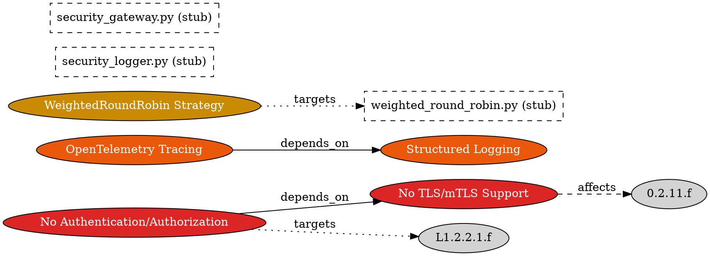

# Concerns Graph - Cross-Cutting Analysis Layer

## Overview

The **Concerns Graph** represents analytical perspectives on the codebase - cross-cutting concerns like security, observability, testing, and devops. Unlike the structural graph, concerns are NOT physical entities but analytical annotations that **reference** structural nodes.

## Key Philosophy

- **Separation of Concerns**: Concerns exist separately from structural nodes
- **References, Not Pollution**: Concerns link to structural nodes via `affects` relationship
- **Multiple Perspectives**: One structural node can be referenced by multiple concerns

## Node Types

### concern

Cross-cutting analytical entity derived from `domain_gaps/*.csv`.

```json
{
  "id": "string",            // e.g., "SEC-001", "OBS-001"
  "node_type": "concern",
  "domain": "string",          // Cross-cutting domain: "security", "observability", "testing", "devops", "wiring_di", "gateway_sdk"
  "category": "string",        // e.g., "missing_component", "design_flaw", "incomplete_implementation"
  "title": "string",           // Human-readable title
  "description": "string",     // Full description
  "severity": "enum",          // "critical" | "high" | "medium" | "low"
  "status": "string",          // e.g., "open", "resolved", "in_progress"
  "impact": "string",          // Impact description
  "dependencies": "string",    // Comma-separated concern IDs this depends on
  "effort_estimate": "string", // e.g., "XS", "S", "M", "L", "XL"
  "proposed_solution": "string",
  "evidence": "string",
  "notes": "string",
  "depth": 1,                  // Concerns at root level
  "parent": null,
  "depth_chain": ["id"],
  "ancestors_chain": ["id"]
}
```

## Relationship Model

| Relationship Type | Source → Target | Description |
|-------------------|----------------|-------------|
| `affects` | concern → file/file_stub | Concern is about this structural node |
| `depends_on` | concern → concern | Concern depends on another concern |
| `targets` | concern → file_stub | Concern will be addressed by implementing this stub |

## GraphViz DOT Representation



## Mermaid Diagram

```mermaid
graph LR
    subgraph CONCERNS["Cross-Cutting Concerns"]
        direction LR
        SEC_001["SEC-001: No TLS/mTLS\n[severity: high]"]
        SEC_002["SEC-002: No Auth\n[severity: high]"]
        OBS_001["OBS-001: Structured Logging\n[severity: high]"]
        NET_005["NET-005: WeightedRoundRobin\n[severity: medium]"]
    end
    
    subgraph STRUCTURAL["Structural Nodes\n(external reference)"]
        0_1_2_4_f["0.1.2.4.f: weighted_round_robin.py\n(stub)"]
        L1_2_5_1_f["L1.2.5.1.f: security_logger.py\n(stub)"]
    end
    
    SEC_001 -.-> "transport/tcp.py"
    SEC_002 == "targets" ==> L1_2_5_1_f
    NET_005 == "targets" ==> 0_1_2_4_f
    
    SEC_002 --> SEC_001
    classDef concern fill:#dc2626,color:white;
    classDef obs fill:#ea580c,color:white;
    classDef structural fill:#e5e7eb,stroke-dasharray: 5 5;
```

## Core Methods

| Method | Signature | Description |
|--------|-----------|-------------|
| `load_concerns()` | `() -> list` | Load all concerns from domain_gaps/*.csv |
| `affects()` | `(concern_id) -> list` | Get structural nodes this concern references |
| `severity_filter()` | `(level) -> list` | Get concerns with severity >= level |
| `impact_analysis()` | `(file_id) -> list` | Get all concerns affecting a file |
| `domain_coverage()` | `(domain) -> stats` | Concern statistics per cross-cutting domain |