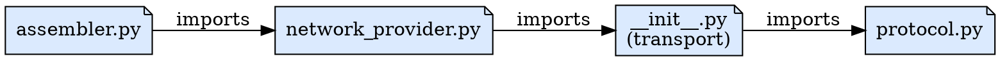
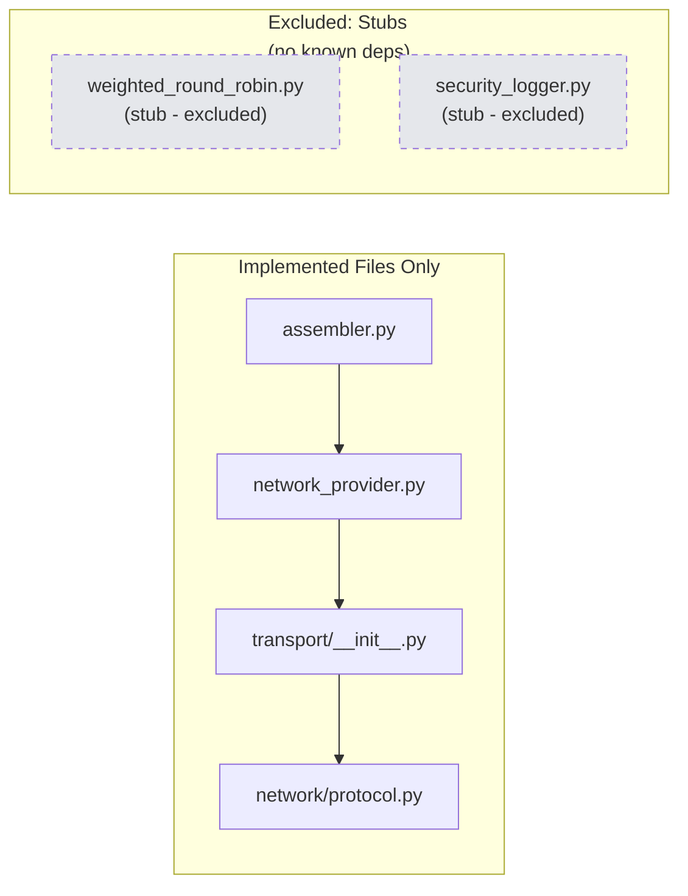

# Dependency Graph - Runtime Import Analysis

## Overview

The **Dependency Graph** captures runtime import relationships between **implemented files only**. File stubs have no dependencies (unknown until implementation). This graph powers impact analysis and topological ordering.

## Key Philosophy

- **Implemented Only**: Only `file` nodes (not `file_stub`) participate
- **Derived from Analysis**: Requires `register_dependencies()` scan of source code
- **Impact Analysis**: Powers "what breaks if I change X?"

## Node Types

Uses only `file` nodes from structural graph:

```json
{
  "id": "string",           // From structural graph: "0.1.2.f"
  "name": "string",
  "node_type": "file",       // Only "file", not "file_stub"
  "path": "string",
  "parent": "string",
  "imports": ["string"],     // IDs of files this file imports
  "imported_by": ["string"], // IDs of files that import this file
  "depth_chain": ["string"]
}
```

## Relationship Model

| Relationship Type | Source → Target | Description |
|-------------------|----------------|-------------|
| `imports` | file → file | Source code imports target module |
| `imported_by` | file → file | Target is imported by source |

## GraphViz DOT Representation



## Mermaid Diagram



## Core Methods

| Method | Signature | Description |
|--------|-----------|-------------|
| `imports()` | `(file_id) -> list` | Get files that this file imports |
| `imported_by()` | `(file_id) -> list` | Get files that import this file |
| `detect_cycles()` | `(domain?) -> list` | Find circular dependencies |
| `topological_sort()` | `(domain?) -> list` | Order files by dependencies |
| `impact_analysis()` | `(file_id, depth) -> tree` | Transitive dependents |
| `critical_path()` | `() -> list` | Longest chain of dependencies |

## Integration with Structural Graph

```python
# The dependency graph builds on structural graph
structural = StructuralGraph().build()
dependency = DependencyGraph().from_structural(structural)

# Each file node's imports are populated via AST scanning
for file_node in structural.get_files():
    dependency.register_imports(file_node.id)
```

## Data Source

- `src/**/*.py` - Python source files scanned via AST
- `files.csv` - Used to map file paths to taxonomy IDs