# Structural Graph - Single Source of Truth

## Overview

The **Structural Graph** is the canonical representation of the codebase's physical organization. It maintains the single source of truth for all architectural entities: domains, subdomains, files, and file stubs. All other graphs derive context from this structure without polluting it.

## Node Types

### 1. folder_domain

Root-level organizational units (OSI layers + cross-cutting domains).

```json
{
  "id": "string",           // e.g., "0.1", "L1.2"
  "name": "string",         // e.g., "network", "security"
  "node_type": "folder_domain",
  "parent": null,
  "depth": 1,
  "depth_chain": ["string"],     // [id]
  "ancestors_chain": ["string"]  // [id]
}
```

### 2. folder_subdomain

Sub-containers within domains for organization.

```json
{
  "id": "string",           // e.g., "0.1.1", "L1.2.5"
  "name": "string",         // e.g., "adapters", "logging"
  "node_type": "folder_subdomain",
  "parent": "string",       // References folder_domain.id
  "depth": 2,
  "depth_chain": ["string"],     // [parent_id, id]
  "ancestors_chain": ["string"]  // [id, parent_id]
}
```

### 3. file

Physically implemented, production-grade code.

```json
{
  "id": "string",               // e.g., "0.1.2.f", "0.6.2.1.f"
  "name": "string",             // e.g., "protocol.py", "loader.py"
  "node_type": "file",
  "path": "string",             // Filesystem path: "network/protocol.py"
  "parent": "string",           // References folder_subdomain.id
  "depth": 3,
  "classification": "Exists",
  "development_state": "enum",  // "production-grade" | "tested" | "implemented" | "scaffold" | "stub"
  "architectural_state": "enum", // "current" | "deprecated" | "needs-redesign" | "deleted"
  "required_concerns": "string", // Comma-separated concern IDs this file addresses
  "depth_chain": ["string"],
  "ancestors_chain": ["string"],
  "depends_on": ["string"],     // Runtime import dependencies (populated by register_dependencies())
  "depended_by": ["string"]     // Reverse dependencies
}
```

### 4. file_stub

To-be-implemented placeholders (stubs). Same attributes as `file` but:
- `classification`: "To_Be_Implemented"
- `development_state`: "not_started" | "in_progress" | "blocked"
- `depends_on`: Empty (unknown until implementation)

## Relationship Model

| Relationship Type | Source → Target | Description |
|-------------------|----------------|-------------|
| `parent_of` | folder_domain → folder_subdomain | Domain contains subdomain |
| `parent_of` | folder_subdomain → file/file_stub | Subdomain contains file |

## GraphViz DOT Representation

```dot
digraph StructuralGraph {
    rankdir=TB;
    node [shape=box, style=filled];
    
    // Domains
    "0.1" [label="network", fillcolor="#7c3aed", fontcolor=white];
    "0.2" [label="transport", fillcolor="#8b5cf6", fontcolor=white];
    "0.3" [label="session", fillcolor="#a855f7", fontcolor=white];
    "0.4" [label="presentation", fillcolor="#c084fc", fontcolor=white];
    "0.5" [label="protocols", fillcolor="#d8b4fe", fontcolor=black];
    "0.6" [label="wiring", fillcolor="#e9d5ff", fontcolor=black];
    "0.7" [label="application", fillcolor="#f3e8ff", fontcolor=black];
    "0.8" [label="actors", fillcolor="#f3e8ff", fontcolor=black];
    
    // Cross-cutting domains
    "L1.0" [label="tests", fillcolor="#06b6d4", fontcolor=white];
    "L1.1" [label="devops", fillcolor="#0891b2", fontcolor=white];
    "L1.2" [label="security", fillcolor="#0d9488", fontcolor=white];
    
    // Subdomains (example)
    "0.1.1" [label="adapters", shape=folder];
    "0.1.2" [label="algorithms", shape=folder];
    "0.1.3" [label="resilience", shape=folder];
    
    "L1.2.1" [label="tls", shape=folder];
    "L1.2.2" [label="auth", shape=folder];
    "L1.2.3" [label="encryption", shape=folder];
    "L1.2.4" [label="management", shape=folder];
    "L1.2.5" [label="logging", shape=folder];
    "L1.2.6" [label="observability", shape=folder];
    "L1.2.7" [label="pki", shape=folder];
    
    // Files
    "0.1.2.1.f" [label="__init__.py", shape=note];
    "0.1.2.2.f" [label="least_active.py", shape=note];
    "0.1.2.3.f" [label="round_robin.py", shape=note];
    
    "0.1.2.4.f" [label="weighted_round_robin.py (stub)", shape=note, style=dashed];
    
    // Edges
    "0.1" -> "0.1.1";
    "0.1" -> "0.1.2";
    "0.1" -> "0.1.3";
    
    "0.1.2" -> "0.1.2.1.f";
    "0.1.2" -> "0.1.2.2.f";
    "0.1.2" -> "0.1.2.3.f";
    "0.1.2" -> "0.1.2.4.f";
}
```



## Mermaid Diagram

```mermaid
graph TD
    subgraph OSI_LAYERS["network"]
        0_1["network"]
    end
    
    subgraph OSI_LAYERS2["transport"]
        0_2["transport"]
    end
    
    subgraph OSI_LAYERS3["session"]
        0_3["session"]
    end
    
    subgraph OSI_LAYERS4["presentation"]
        0_4["presentation"]
    end
    
    subgraph OSI_LAYERS5["protocols"]  
        0_5["protocols"]
    end
    
    subgraph CROSS_CUTTING["security (L1)"]
        L1_2["security"]
        L1_2_1["tls"]
        L1_2_2["auth"]
        L1_2_5["logging"]
        L1_2_7["pki"]
        
        L1_2 --> L1_2_1
        L1_2 --> L1_2_2
        L1_2 --> L1_2_5
        L1_2 --> L1_2_7
    end
    
    0_1 --> 0_1_2["algorithms/"]
    0_1_2 --> 0_1_2_1_f["least_active.py"]
    0_1_2 --> 0_1_2_2_f["round_robin.py"]
    0_1_2 --> 0_1_2_4_f["weighted_round_robin.py (stub)"]
```

## Core Methods

| Method | Signature | Description |
|--------|-----------|-------------|
| `build_hierarchy()` | `() -> self` | Loads domains.csv, subdomains.csv, files.csv |
| `get_ancestor_chain()` | `(id) -> list` | Returns path from root to node |
| `get_children()` | `(id) -> list` | Returns all children of a node |
| `register_dependencies()` | `() -> self` | Scans source code and populates `depends_on` |
| `find_by_path()` | `(path) -> node_id` | Maps filesystem path to taxonomy ID |
| `get_nodes_by_domain()` | `(domain_id) -> list` | All nodes within domain hierarchy |

## Data Sources

- `domains.csv` - Root domain definitions
- `subdomains.csv` - Subdomain definitions with parent references
- `files.csv` - File definitions with classification/state attributes