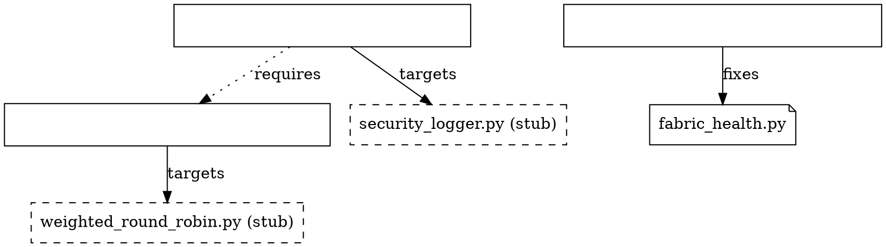
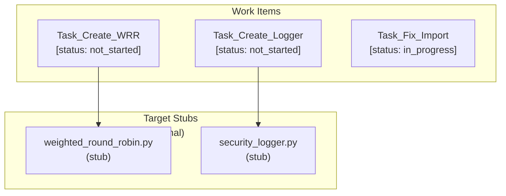

# Tasks Graph - Implementation Work Items

## Overview

The **Tasks Graph** manages work items for implementing stubs and fixing issues. Unlike structural and concerns graphs, tasks are ephemeral - they can be created, completed, and removed without affecting the canonical structure.

## Node Types

### task_implement

Work item for creating a new implementation.

```json
{
  "id": "string",           // e.g., "Task_Create_WRR", "Task_Impl_Logger"
  "node_type": "task_implement",
  "target_structural_id": "string",  // References file_stub.id
  "target_path": "string",           // Expected filesystem path
  "priority": "enum",                // "low" | "medium" | "high" | "critical"
  "status": "enum",                  // "not_started" | "in_progress" | "completed" | "blocked"
  "effort_estimate": "string",       // e.g., "1d", "3d", "1w"
  "required_concerns": ["string"],     // Concern IDs this task addresses
  "created_at": "ISO datetime",
  "updated_at": "ISO datetime"
}
```

### task_debug

Work item for debugging existing code.

```json
{
  "id": "string",
  "node_type": "task_debug",
  "target_structural_id": "string",    // References file.id or module
  "bug_type": "string",              // From buggy_components
  "proposed_fix": "string",
  "severity": "enum",                // "critical" | "high" | "medium" | "low"
  "status": "enum",                  // "not_started" | "in_progress" | "completed" | "blocked"
  "requires_tasks": ["string"],       // Other task IDs that must complete first
  "created_at": "ISO datetime"
}
```

## Relationship Model

| Relationship Type | Source → Target | Description |
|-------------------|----------------|-------------|
| `targets` | task → file_stub | Task is to implement this stub |
| `fixes` | task_debug → file | Task debugs this file |
| `requires` | task → task | Task depends on another task |
| `addresses` | task → concern | Task addresses this concern |

## GraphViz DOT Representation



## Mermaid Diagram



## Core Methods

| Method | Signature | Description |
|--------|-----------|-------------|
| `status_filter()` | `(status) -> list` | Get tasks with given status |
| `priority_queue()` | `() -> list` | Get tasks sorted by priority |
| `dependency_tracking()` | `(task_id) -> list` | Get task dependencies |
| `create_task()` | `(file_stub_id, priority) -> task_id` | Create new implementation task |
| `complete_task()` | `(task_id) -> bool` | Mark task complete, promote stub to file |
| `blocked_tasks()` | `() -> list` | Get tasks blocked by dependencies |