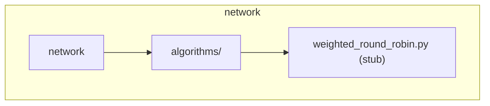

# CLI Presentation Layer

## Overview

The CLI presentation layer is a thin interface that consumes the unified presentation business logic layer. It focuses on text/tty output formats suitable for terminal interaction.

## Architecture

```
┌────────────────────────────────────────┐
│            CLI Interface               │
│  - Command parsing (argparse/click)    │
│  - Output formatting (text/json/yaml)  │
│  - User interaction                    │
└─────────────────▲──────────────────────┘
                  │
┌─────────────────┴──────────────────────┐
│  Presentation Business Logic Layer     │
│  - GraphPresenter queries            │
│  - Data serialization                │
│  - Error wrapping                    │
└────────────────────────────────────────┘
```

## Command Structure

### Primary Commands

```bash
# Taxonomy commands
graphify taxonomy summary
graphify taxonomy nodes --type file --format json
graphify taxonomy node 0.1.2.f --detail

# Concern commands
graphify concerns list --domain security
graphify concerns show SEC-001
graphify concerns top --severity critical --limit 5

# Dependency commands
graphify deps show 0.6.1.f --impact
graphify deps cycles
graphify deps order

# Task commands
graphify tasks list --status not_started
graphify tasks pending
```

## Output Formats

### Text Format (default)

```
Graph Taxonomy Summary
======================
Domains: 11
Subdomains: 34
Files: 86
File Stubs: 43

By Type:
  folder_domain: 11
  folder_subdomain: 34
  file: 86
  file_stub: 43
```

### JSON Format

```bash
graphify taxonomy summary --format json
```

```json
{
    "status": "success",
    "data": {
        "domains": [...],
        "subdomains": [...]
    },
    "metadata": {
        "timestamp": "2026-05-31T12:00:00",
        "query_type": "taxonomy_summary",
        "record_count": 130
    }
}
```

### Mermaid Format

```bash
graphify taxonomy diagram --format mermaid
```



## Implementation

### CLI Entry Point

```python
# graph/cli.py
import click
from .presentation.presenter import GraphPresenter
from . import Graph

@click.group()
def cli():
    pass

@cli.command()
@click.option('--format', 'output_format', default='text')
def taxonomy(output_format):
    graph = Graph()
    graph.build_folder_taxonomy()
    presenter = GraphPresenter(graph)
    
    summary = presenter.get_taxonomy_summary()
    
    if output_format == 'json':
        click.echo(json.dumps(summary, indent=2))
    else:
        # Text formatting
        present_taxonomy_text(summary)

@cli.command()
@click.argument('node_id')
def node(node_id):
    graph = Graph()
    presenter = GraphPresenter(graph)
    detail = presenter.get_node_detail(node_id)
    present_node_text(detail)
```

## Text Presentation Functions

```python
# presentation/cli_formatter.py
def present_taxonomy_text(summary: dict) -> str:
    """Format taxonomy summary for terminal."""
    lines = ["Graph Taxonomy Summary", "=" * 25]
    lines.append(f"Domains: {summary['by_type'].get('folder_domain', 0)}")
    lines.append(f"Subdomains: {summary['by_type'].get('folder_subdomain', 0)}")
    lines.append(f"Files: {summary['by_type'].get('file', 0)}")
    lines.append(f"File Stubs: {summary['by_type'].get('file_stub', 0)}")
    return "\n".join(lines)

def present_concern_text(concern: dict) -> str:
    """Format concern detail for terminal."""
    lines = [
        f"[{concern['id']}] {concern['title']}",
        "-" * 40,
        f"Domain: {concern['domain']}",
        f"Severity: {concern['severity']}",
        f"Status: {concern['status']}",
        f"Impact: {concern['impact']}"
    ]
    if concern.get('affects_structural'):
        lines.append(f"Affects: {', '.join(concern['affects_structural'])}")
    return "\n".join(lines)
```

## Design Constraints

1. **No Direct Graph Access**: CLI must use `GraphPresenter` exclusively
2. **Pure Functions**: All formatters are pure functions (no side effects)
3. **Streaming Friendly**: Large outputs can be paged (pipe to `less`)
4. **Exit Codes**: 0 = success, 1 = error, 2 = no results

## CLI-Specific Extensions

```python
# presentation/cli_extensions.py
class CLIPresentationExtensions:
    @staticmethod
    def colorize_severity(severity: str) -> str:
        """Add terminal colors to severity levels."""
        colors = {
            "critical": "\033[91m",  # Red
            "high": "\033[93m",      # Yellow
            "medium": "\033[94m",    # Blue
            "low": "\033[92m"       # Green
        }
        reset = "\033[0m"
        return f"{colors.get(severity, '')}{severity}{reset}"
```

## Related Documentation

- `presentation_logic_unified_base_back_layer.md`
- `Web_UI_Interactive_Dashboard/web_ui_presentation_layer.md`